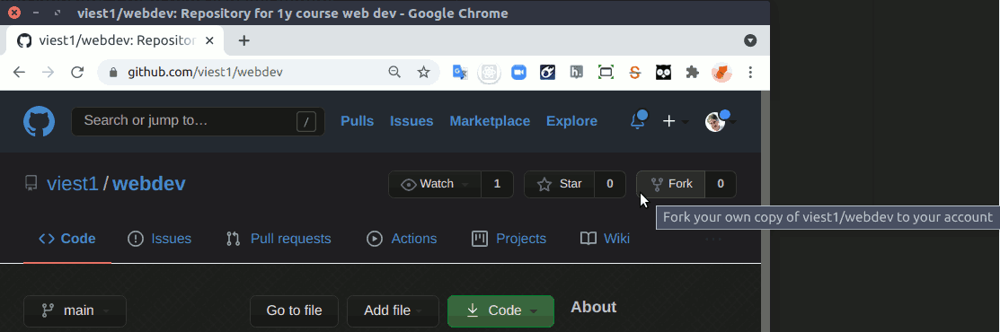
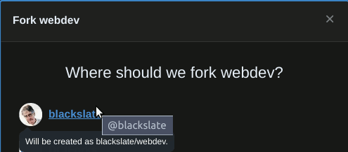
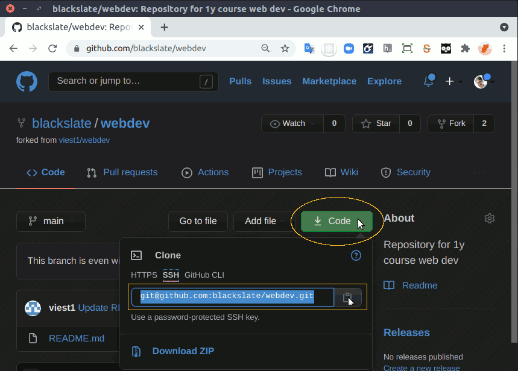
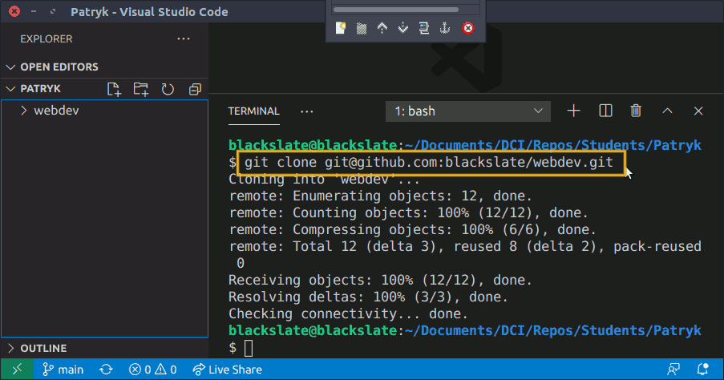
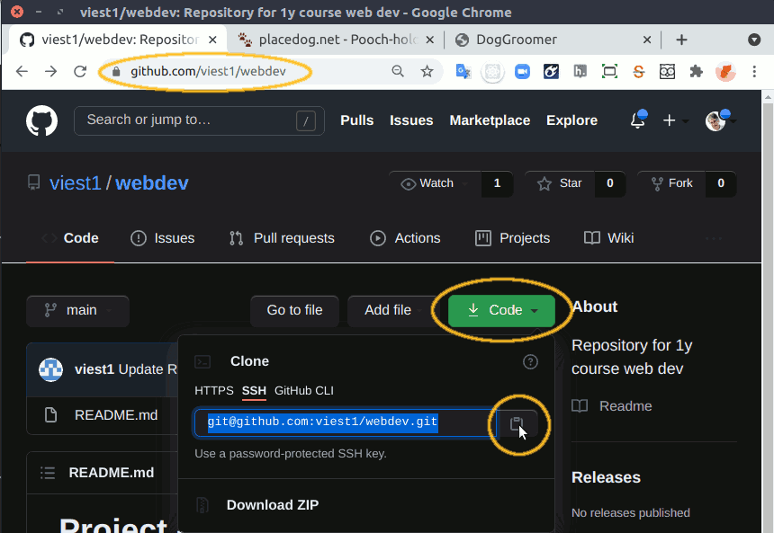
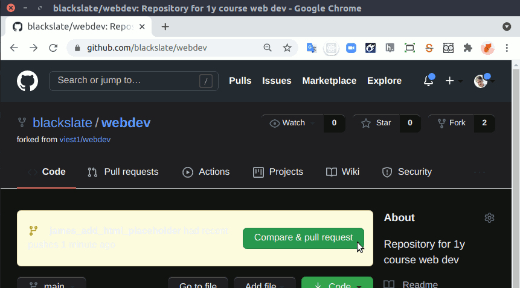
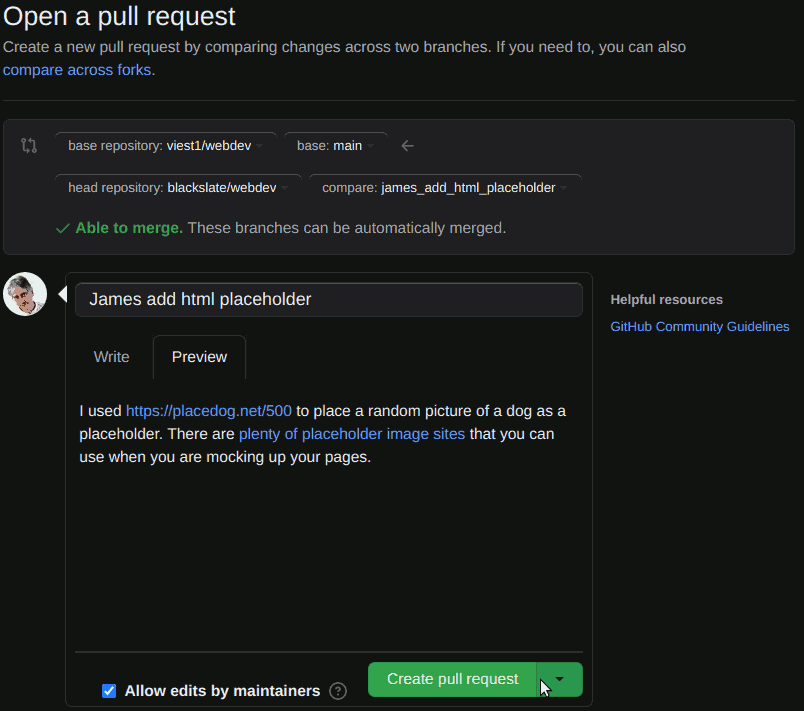
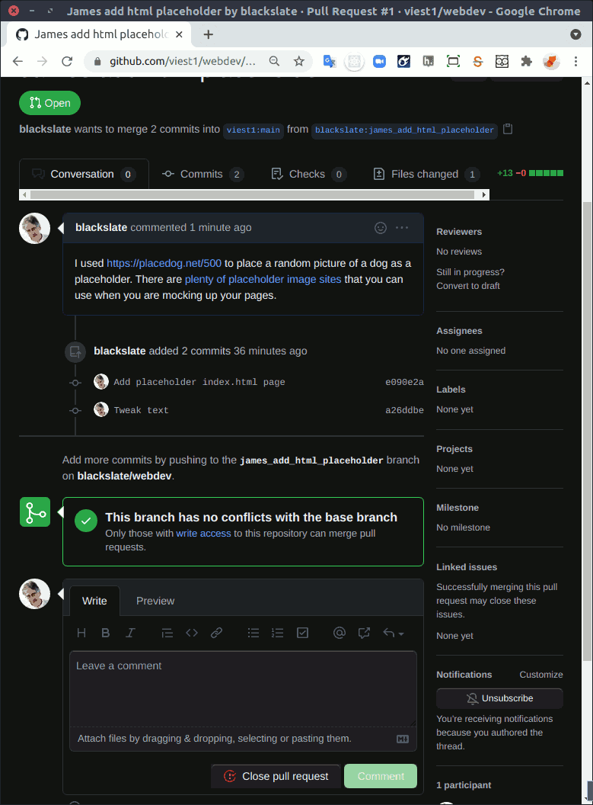

# Contributing to an open source project

## Forking
* On GitHub, visit the repository for the project that you want to contribute to
* E.g.: [Patryk's project](https://github.com/viest1/webdev)
* Click on the Fork button at the top right corner of the page

* Select your personal account in the Where Should We Fork ...? dialog

* You will be transferred automatically to the home page of a new repository.
* Click on the green Code button, then copy the URL of your new repository.


## Clone your fork to your development computer
* Open a new window in VS Code (`File > New Window` or Shift-Ctrl-N)
* In menu bar for the new window, choose `File > Open Folder`
* Navigate to the parent folder for your local repository, or create a new folder with the project owner's name
* You can close the Welcome document.
* Use the menu item `Terminal > New Terminal` to open a Terminal pane at the bottom of your new window
* Type the command `git clone ` and then paste the URL that you copied from GitHub

* You should now see the name of the repository in the EXPLORER column on the left of your VS Code window.

## Create a specific branch for each change you wish to propose
* In the Terminal pane, type `cd ` then the name of the repository folder
* *Remember that you can use a shortcut: start typing the name and then press Tab to autocomplete it*
* E.g.: `cd webdev/`
* Check that you have are currently working on the `main` branch
* `git branch -v`
```bash
* main 7c07998 Update README.md
```
* Checkout a new branch with a name that describes the issue you plan to work on:
* `git checkout -b james_add_html_placeholder`
```bash
Switched to a new branch 'james_add_html_placeholder'
```

## Update the `remote`s for this local repository
* Check what remote repositories are already linked to your local repository.
* `git remote -v`
```bash
origin  git@github.com:blackslate/webdev.git (fetch)
origin  git@github.com:blackslate/webdev.git (push)
```
* Note that `origin` is the default name for a repository created on GitHub. This is your fork repository that you just cloned locally.
* Add a new `upstream` repository. Using the name `upstream` tells GitHub where to find the original repository that your forked your repository from. You can get the URL for the `upstream` repository by visiting the repository that you forked from, clicking on the green Code button, and selecting the URL from the popup:

* `git remote add upstream git@github.com:viest1/webdev.git`
* `git remote -v`
```bash
origin  git@github.com:blackslate/webdev.git (fetch)
origin  git@github.com:blackslate/webdev.git (push)
upstream        git@github.com:viest1/webdev.git (fetch)
upstream        git@github.com:viest1/webdev.git (push)
```

## Make the changes that you want to propose
* Edit, add or delete files
* Check the status (to see if you have not included files that you don't want to commit). Use `git status` and `git diff`:
* `git status`
```bash
On branch james_add_html_placeholder
Untracked files:
  (use "git add <file>..." to include in what will be committed)

        index.html

nothing added to commit but untracked files present (use "git add" to track)
```
* `git diff`
```bash
diff --git a/index.html b/index.html
new file mode 100644
index 0000000..8c34d19
--- /dev/null
+++ b/index.html
@@ -0,0 +1,13 @@
+<!DOCTYPE html>
+<html lang="en">
+<head>
+  <meta charset="UTF-8">
+  <meta http-equiv="X-UA-Compatible" content="IE=edge">
+  <meta name="viewport" content="width=device-width, initial-scale=1.0">
+  <title>DogGroomer</title>
+</head>
+<body>
+  
+  <p>Here's a placeholder HTML page to get the project started.</p>
+</body>
+</html>
```
* Add your changes to git`s "staging area" (your supermarket basket):
* `git add .`
* Commit your changes (pay at the cash desk and get a receipt)
* `git commit -m "Add placeholder index.html page"`
```bash
[james_add_html_placeholder e090e2a] Add placeholder index.html page
 1 file changed, 13 insertions(+)
 create mode 100644 index.html
 ```
* You can check the log, either in its entirety (tap the spacebar to see more entries, type Shift-Q to exit the log)...
* `git log`
commit e090e2a5bb71836e83d8dcd7cfbb18c3a35f908c
Author: James Newton <blackslate@lexogram.com>
Date:   Wed Apr 14 12:41:54 2021 +0300

    Add placeholder index.html page

commit 7c07998ba5df7ed730a937b00ff1c05e2a68a06a
Author: viest1 <80831404+viest1@users.noreply.github.com>
Date:   Mon Apr 12 23:43:56 2021 +0200

    Update README.md

commit 821c8395bd71133990088a12a32f7f0dc9eb79a8
Author: viest1 <viest1994@gmail.com>
Date:   Tue Apr 6 17:01:46 2021 +0200

    f

commit 1e0e668c8efedf0cb364903934df4787b4815378
Author: viest1 <viest1994@gmail.com>
Date:   Tue Apr 6 16:54:26 2021 +0200

    First commit

commit 4e9e5c9d1547b6a06b0c2159c249618383964d32
Author: viest1 <viest1994@gmail.com>
Date:   Tue Apr 6 16:19:41 2021 +0200

    First commit

* ... or in summary form:
* `git log --oneline`
```bash
e090e2a Add placeholder index.html page
7c07998 Update README.md
821c839 f
1e0e668 First commit
4e9e5c9 First commit
```

##
* Push the branch that you have just changed to your fork on GitHub. Note that `origin` is the default remote name for a repository on GitHub
* `git push origin james_add_html_placeholder`
```bash
Counting objects: 3, done.
Delta compression using up to 4 threads.
Compressing objects: 100% (3/3), done.
Writing objects: 100% (3/3), 563 bytes | 0 bytes/s, done.
Total 3 (delta 0), reused 0 (delta 0)
remote:
remote: Create a pull request for 'james_add_html_placeholder' on GitHub by visiting:
remote:      https://github.com/blackslate/webdev/pull/new/james_add_html_placeholder
remote:
To git@github.com:blackslate/webdev.git
 * [new branch]      james_add_html_placeholder -> james_add_html_placeholder
```
* Note that the details of the `upstream` branch are sent along with the changes, so that GitHub knows that you might want to make a pull request to the original project.

## Create a Pull Request
* Visit the GitHub page for your fork
* Click on the big green Compare & Pull Request button

* Enter a useful message so that the project maintainer knows what to expect in the Pull Request
* Click on the Create Pull Request button

* You'll be taken to a page within the upstream repository where you can discuss the pull request with the maintainer of the project.

