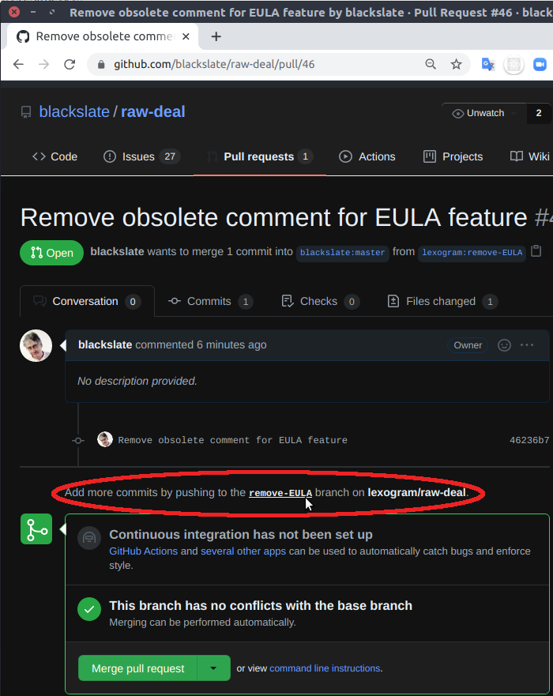
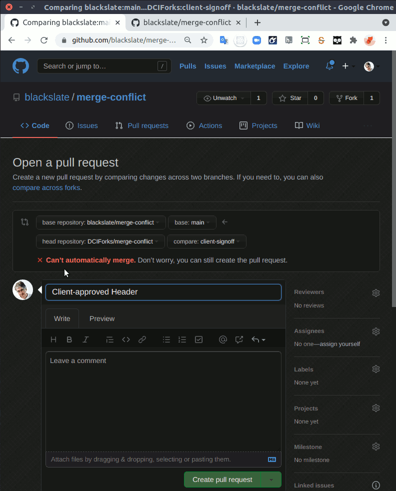
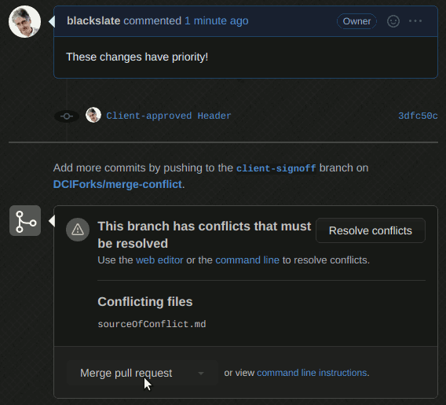
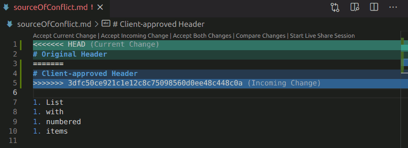

# What happens when you receive a Pull Request

When someone creates a Pull Request it creates a hidden branch on GitHub. Here's an example where a collaborator called "lexogram" makes a Pull Request on a repository owned by "blackslate":

* The "hidden" branch is mentioned on the specific page for the Pull Request...

* ... but it is not shown on the main Code page


## Pulling the PR branch to your development computer
Rather than blindly `merge` the changes, you will want to check out a new branch on your development computer and test the changes.
* In the Terminal in VS Code, create a new branch, with your `main` branch as its [start point](https://git-scm.com/docs/git-checkout#Documentation/git-checkout.txt-emgitcheckoutem-b-Bltnewbranchgtltstartpointgt). By convention, you should use a branch name created from the name of the collaborator who made the Pull Request and the name of the branch that this collaborator created:
* `git checkout -b blackslate-mod_arta main`
* Now you can `pull` the Pull Request branch from your repository to your local computer:
* `git pull https://github.com/blackslate/parallax.git mod_arta`

## Review the Pull Request
* Test the branch locally, make changes as needed
* Request that the collaborator makes changes, and pushes them to the same branch
* `pull` any new commits from the collaborator and test again
* If/when you are happy, you can merge the changes and update on your GitHub repository, for others to see:
* `git checkout main`
* `git merge --no-ff blackslate-mod_arta`
* `git push origin main`

## How collaborators can synch a fork
* `git checkout main`
* `git pull upstream`
Shorthand for:
* `git fetch upstream`
* `git merge upstream/main`

## Two models for collaborating
* Fork and Push
  - Used by open source projects
  - Allows anyone to make Pull Requests
  - Only project maintainers can merge
* Shared Repository
  - Use for in-house projects
  - Many developers have `push` and `merge` access to the `main` branch
  - Pull Requests are used to generate discussion and peer review
  - Discussion provides an extra level of protection before pushing to `main`
  - Any of the trusted developers can perform the `merge`

## Describing the work still to be done
* Issues
* [Using keywords in message to link to issues](https://docs.github.com/en/github/managing-your-work-on-github/linking-a-pull-request-to-an-issue)

## Merge conflicts
If two collaborators both make changes in the same place in the same file, it is not possible to merge automatically.

You can create a Pull Request, but the Merge Pull Request button will be disabled.

* You must follow the command line instructions:
* `git checkout -b DCIForks-client-signoff main`
* `git pull https://github.com/DCIForks/merge-conflict.git client-signoff`

* Select one alternative or the other:
```md
# Client-approved Header

1. List
1. with
1. numbered
1. items
```
* `git add .`
* `git commit -m "Client-approved Header accepted"`
* `git log`
```bash
commit 7550e24a6fd80ce706803f83b390c8e4a3db2647
Merge: 970e77c 3dfc50c
Author: James Newton <blackslate@lexogram.com>
Date:   Thu Apr 15 00:57:08 2021 +0300

    Client-approved Header accepted

commit 970e77c575666f904fa2709cc41886d727459a37
Author: James Newton <blackslate@lexogram.com>
Date:   Thu Apr 15 00:41:53 2021 +0300

    Modify Header

commit bbfa73cc0ad2d051952c3485a6178ecbf42203c9
Author: James Newton <blackslate@lexogram.com>
Date:   Thu Apr 15 00:40:04 2021 +0300

    Switch to numbered list

commit 3dfc50ce921c1e12c8c75098560d0ee48c448c0a
Author: James Newton <blackslate@lexogram.com>
Date:   Thu Apr 15 00:38:20 2021 +0300

    Client-approved Header

commit 85b9d7408068809ad554c122b76e737dff10f60a
Author: James Newton <blackslate@lexogram.com>
Date:   Thu Apr 15 00:26:55 2021 +0300

    Original version with bullet points
```
