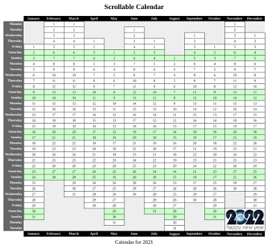

# Submodule: Data

By the end of this sub module, you should be able to:

* Understand how to represent and gather data in HTML using tables and forms
* Understand the server-client relationship and compare between basic HTTP methods for sending data
* Use HTML attributes to perform data validation and sanitization
* Use CSS to style forms and tables
    
---
# Tables

[Calendar Demo](https://dciforks.github.io/UIB-table-calendar/)

## Organizing Data in Tables
- [ ] Tables are only for tabular data, never for layout
- [ ] `<table>` [w3schools](https://www.w3schools.com/html/html_tables.asp) | [MDN](https://developer.mozilla.org/en-US/docs/Web/HTML/Element/table)

|Keyword |Type| Required? | Children | Purpose
|---|---|---|---|---
|table |element|by definition | |
|[caption](https://developer.mozilla.org/en-US/docs/Web/HTML/Element/caption) |element| optional | | Appears by default centred above table Must be the first descendant of the table
|[colgroup](https://developer.mozilla.org/en-US/docs/Web/HTML/Element/colgroup) |element| zero or more | col | Defines a group of columns Use with `span` attribute or `col` elements Can style only border, background, width and visibility
|[col](https://developer.mozilla.org/en-US/docs/Web/HTML/Element/col) |element| optional| | Defines a (span of) column(s) Use with `span` attribute Can style only border, background, width and visibility
|[thead](https://developer.mozilla.org/en-US/docs/Web/HTML/Element/thead) |element|  optional | |
|[tbody](https://developer.mozilla.org/en-US/docs/Web/HTML/Element/tbody) |element|  _either_ `tbody` _or_ `tr` |`tr` |
|[tr](https://developer.mozilla.org/en-US/docs/Web/HTML/Element/tr)|element|  _either_ `tbody` _or_ `tr` |td | **table row**
|[th](https://developer.mozilla.org/en-US/docs/Web/HTML/Element/th) |element|  | |**table header** optional `scope` may be `col`, `colgroup`, `row` or `rowgroup`
|[td](https://developer.mozilla.org/en-US/docs/Web/HTML/Element/td)|element|  | | **table data cell** `td` elements are not children of `colgroup` or `col` so they do not inherit properties such as `text-align` and `vertical-align` from them
|[tfoot](https://developer.mozilla.org/en-US/docs/Web/HTML/Element/tfoot)|element|  optional | |
|**Attributes**
|[span](https://www.w3schools.com/tags/att_span.asp) |attribute|||used with `colgroup` and `col` to define more than one column
|[colspan](https://www.w3schools.com/tags/att_td_colspan.asp) |attribute|||used with `td` to make a cell span more than one column
|[rowspan](https://www.w3schools.com/tags/att_td_rowspan.asp   ) |attribute|||used with `td` to make a cell span more than one row
|**Accessibility**
|[scope](https://www.w3schools.com/tags/att_scope.asp) |attribute|||used with `tr` to define if header is for `col`, `colgroup`, `row` or `rowgroup`
|[headers](https://developer.mozilla.org/en-US/docs/Learn/HTML/Tables/Advanced#tables_for_visually_impaired_users) |attribute|||used with `th` or `td` to indicate the `id`(s) of related header cells

---

## Parts of a Table
### Essential elements
- [ ] Rows: `<tr>`
- [ ] Cells: `<td>`
### Optional Semantic sections:
- [ ] Additional info with `<caption>`
- [ ] Headers for columns and rows: `<thead>`, `<th scope=[...]>`
- [ ] The `scope` attribute for improved accessibility of header cells
- [ ] Body: `<tbody>`
- [ ] Foot: `<tfoot>`
- [ ] Hierarchical headers: `<... headers="header-id,...">`
### Defining columns
- [ ] `<colgroup>`
- [ ] `<col>`
- [ ] `<... span="3" class="column-name">`
### Spanning rows and columns
- [ ] Multiple rows:`<td rowspan=""..."">`
- [ ] Multiple columns: `<td colspan=""..."">`
- [ ] [Examples](https://www.computerhope.com/issues/ch001655.htm)
###
Other elements can be styled as tables:
- [ ] `display: table` ([css-tricks](https://css-tricks.com/almanac/properties/d/display/#table-values))

## Styling Tables
- [ ] Separate borders with `border-spacing` [MDN](https://developer.mozilla.org/en-US/docs/Web/CSS/border-spacing)
- [ ] Overriding borders with css `border-collapse` [MDN](https://developer.mozilla.org/en-US/docs/Web/CSS/border-collapse)
   * `collapse`
   * `separate`
- [ ] Zebra stripes with pseudo child selectors: `:nth-child() { ... }` [MDN](https://developer.mozilla.org/en-US/docs/Web/CSS/:nth-child)
- [ ] Easy layout with `table-layout: fixed` and `:nth-child() { ... }`
   * `auto`
   * `fixed`
   * Need to set `width` of table for `fixed` to work
- [ ] Specifying `<caption>` placement with `caption-side` [MDN](https://developer.mozilla.org/en-US/docs/Web/CSS/caption-side)
   * `top`
   * `bottom`

- [ ] Using `position: sticky` to keep headers on-screen
- [ ] `:empty` pseudo class for cells with no content

---
## [Table Generator](https://www.rapidtables.com/web/tools/html-table-generator.html)

---

# Exercises

* [Companies Table](https://classroom.github.com/a/IK1oaiZH) 
  
* [Contact Data](https://classroom.github.com/a/PQL8lSAP) 
  
* [Styling Tables](https://classroom.github.com/a/E4eJRlMK) 
 
* [Table Stripes](https://classroom.github.com/a/Goze10pq) 
 
* [Calendar](https://classroom.github.com/a/j1Ce_TbH) 
 

# Resources

[The Complete Guide to Tables](https://css-tricks.com/complete-guide-table-element/)
[Tables.pdf](Tables.pdf)
