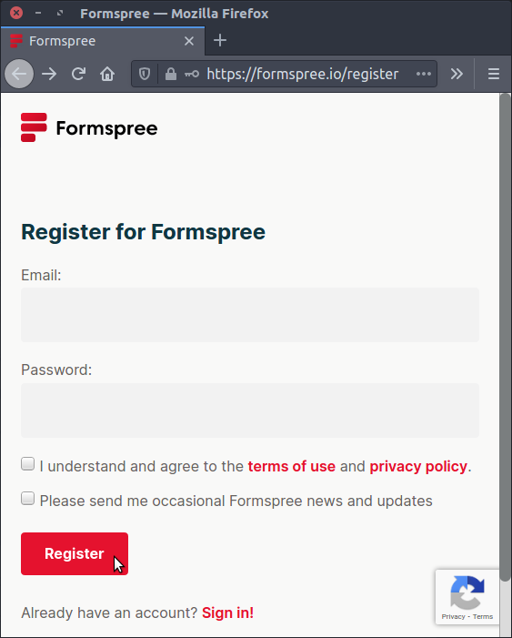

# Forms and Dynamic Data

Forms allow your users to send you data.

A form is shown in your user's browser. Like the other pages on your site, it is served by a _frontend_ server. You are currently using the Live Server plugin for VS Code. To process the submitted form, you'll need a _backend_ server, but you won't be creating one until nearly the end of the course.

For now, you can register with a _form builder_ web site which will send you an email with the data submitted.

## [Register now with Formspree](https://formspree.io/)
- [Walkthrough](formspree/formspree.md)

## HTML Elements

### Essential elements and attributes
- [ ] The `<form ...>` container element
- [ ] The `<... action="...">` URL for the backend server
- [ ] The `<... method="POST">`
   * See more below
- [ ] The `<input>` element (`type="text"` by default)
- [ ] The `<... name="...">` attribute
- [ ] The `<button type="submit">` element

### Labelling elements
- [ ] The `<label for="...">` element
- [ ] Using `id`s with elements to be labelled

## Input Types
- [ ] Other values for the  `<... type="...">` attribute

### Text
- [ ] `type="text"`
- [ ] `type="email"`
- [ ] `type="password"`
- [ ] `type="search"`
- [ ] The `<textarea>` element
- [ ] Default text - the `placeholder` attribute

### Buttons
- [ ] `type="checkbox"`
- [ ] The`value` attribute
- [ ] The `checked` attribute
- [ ] `type="radio"`
- [ ] The `id` attribute
- [ ] The `name` attribute
- [ ] The `value` attribute
- [ ] `<select>`
- [ ] The `<option value="..." selected>` children
- [ ] Grouping with `<optgroup>` children [MDN](https://developer.mozilla.org/en-US/docs/Web/HTML/Element/optgroup)

### Containers and Captions
- [ ] `<form>`
- [ ] `<fieldset>`
- [ ] `<legend>`

### Uploads
- [ ] `<input type="file">`
- [ ] [Complete list of input types](https://developer.mozilla.org/en-US/docs/Web/HTML/Element/input)

## How It Works: RESTful Services
- [ ] URL structure & anatomy
- [ ] HTTP verbs - `GET`, `POST` and the `method` attribute
   * [HTTP request methods](https://developer.mozilla.org/en-US/docs/Web/HTTP/Methods)
   * [REpresentational State Transfer (REST)](https://en.wikipedia.org/wiki/Representational_state_transfer)

## Validated, Sanitized and Secured
- [ ] Concept of client side form validation
- [ ] HTML form controls
- [ ] `required`
- [ ] `minlength` & `maxlength`,
- [ ] `min` & `max`, `type`, `pattern` attributes
- [ ] `:valid` and `:invalid` pseudoclasses
- [ ] Controlled parameters with
- [ ] `<datalist>`
- [ ] `<optgroup>`

## [Examples of Good Form UI](https://blog.hubspot.com/marketing/form-examples)
