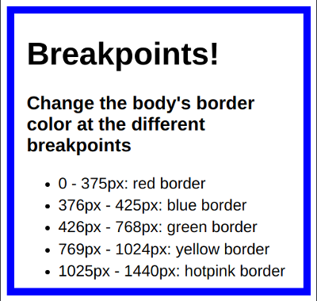
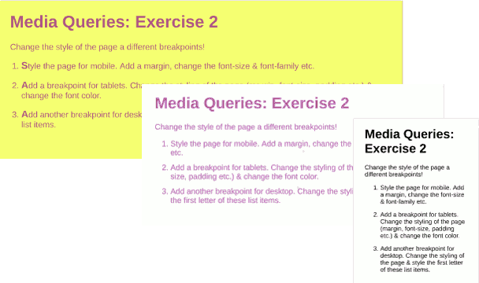
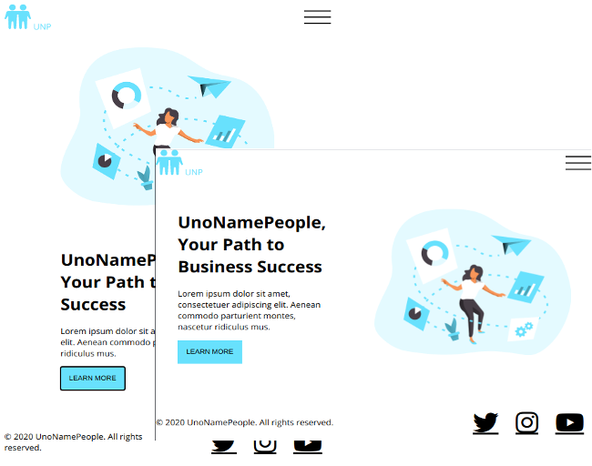
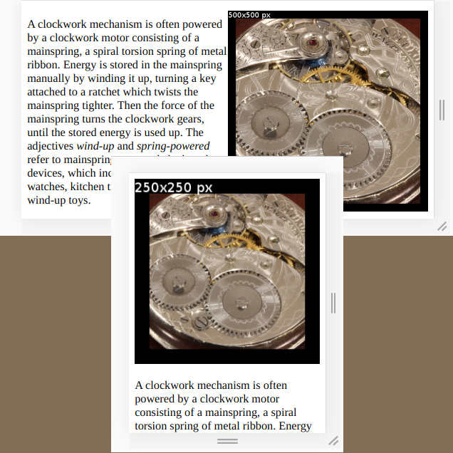

# Final Project
Web Developers and Online Marketers present their final projects at the end of the course during the Final Event. Due to the increasing number of courses, Final Events will be held with more than one course in the future. In order to keep the presentation time per event in check, it is important to limit the number of project groups in each course.
We ask everyone involved to consider the following guideline:
* A group should consist of no less than 4 people. Optimal groups are between 4-5 people.
* People working alone on a project are not allowed to present at the Final Event.
This results in the following benefits:
* Students practice working together in groups, which ultimately qualifies them to enter the job market.
* Chances are high that group members will not be left alone when other members find jobs and leave the course early.
* We are able to host Final Events that provide a great experience for everyone who attends and do not result in online formats lasting several hours

---

# Responsivity

## Objectives
By the end of this sub module, learners should be able to:

* Identify and compare between user experiences in different browsers, screen sizes and use cases
* Understand different screen size breakpoints and the need for designing and creating websites for small screens first
* Use CSS media queries to manipulate text sizes across various screens

### Four Techniques, Three Tools, One Philosophy
* Techniques
  1. CSS Resets
  2. <meta name="viewport" ...>
  3. Media queries
  4. The <picture> element
* Tools
  1. Chrome Device Emulator
  2. Responsive Viewer
  3. Debugging on a Mobile Device
* Philosophy
  1. Mobile first

## Mobile First
### What we can do with phones
- A brief history of web pre and post the smartphone revolution
  * Photos
  * Music
  * Maps
  * Sharing
  * Video chat
  * Making plans (purchase, entertainment, ...)
  * Recipes
  * Banking
  * Alarm
  * ...

### [Statistics](https://gs.statcounter.com/platform-market-share/desktop-mobile-tablet)
* Targeting our users - mobile is the future (and present)
* Desktop, Phones and Tablets
* Variety of screen sizes
* Portrait and Landscape orientation

## CSS Resets
* [Slides](slides/responsivity/Resets-Media-Queries.pdf)
* [reset.css](https://meyerweb.com/eric/tools/css/reset/)
* [normalize.css](https://necolas.github.io/normalize.css/)
* Example of `<h1>` in `<article>` and `<section>` elements
* Adapt to suit your own projects

## HTML viewport settings

### Visualizing
* Create boilerplate HTML with `!` Emmet abbreviation
* Not currently a standard
* Apple Documentation
  * [Configuring the Viewport](https://developer.apple.com/library/archive/documentation/AppleApplications/Reference/SafariWebContent/UsingtheViewport/UsingtheViewport.html)

### The Problem
There are thousands of devices which we can use do connect to a web page, and they come in all shapes and sizes.

On top of that, desktop browsers and browsers on mobile devices behave in different ways.

- A desktop browser shows a resizable window; a mobile browser fills the screen.
- There are two "viewports":
  - The "page" on which the layout appears
  - The "window" through which you can see the page
- Zooming on a mobile gives you a closer view at a part of the page; zooming in a browser might keep the page the same size, and wrap the content to fit.
- Additional gestures: pinch, double-tap
- New technologies are constantly appearing; the standards committees have to play catch-up

### What is a the viewport?
  * visual (vw, vh)
    - 360 x 640 px?
    - (not actual device pixels because of higher density)
    - changes as you zoom
  * layout (% of parent)
    - 980px Safari iPhone
    - 850px Opera
    - 800px Android WebKit
    - 974px IE
    - = visual viewport in fully zoomed-out mode

### [Debugging from your smartphone](mobile_debug.md)
* Android
1. [Configure your Android phone](https://developer.android.com/studio/debug/dev-options.html)
2. [Discover `chrome://inspect#devices`](https://developer.chrome.com/docs/devtools/remote-debugging/)
3. [Access Live Server with Port Forwarding](https://developer.chrome.com/docs/devtools/remote-debugging/local-server/)

* [iOS and Safari](https://appletoolbox.com/use-web-inspector-debug-mobile-safari/)

### Ensuring proper scale
Page fits viewport when zoomed out.

  ```html
  <meta
    name="viewport"
    content="
       width=device-width
       initial-scale=1
    "
  >
  ```
### Attributes
* dimensions: width and height
  * device-width
  * device-height
  * XXpxt — if width of body is set
* initial-scale
* minimum-scale
* maximum-scale
* user-scalable

## Developer Tools for Mobile
### Emulating Devices in Chrome
* [Device Mode](https://developer.chrome.com/docs/devtools/device-mode/)
  * Show Media Queries
  * View in Responsive Mode
  * Watch for changes as Media Queries take effect

### Multiple Device Views
* [Responsive Viewer](https://chrome.google.com/webstore/detail/responsive-viewer/inmopeiepgfljkpkidclfgbgbmfcennb)
* [See Your Site Responsive](http://ami.responsivedesign.is/)


## CSS Media Queries
* [MDN](https://developer.mozilla.org/en-US/docs/Web/CSS/@media)
* [CSS Tricks](https://css-tricks.com/logic-in-media-queries/)
* [Slide Show](slides/responsivity/Resets-Media-Queries.pdf)
- Anatomy of a media query: `@media [media-type] ([media features]) { ... }`
- [Other "at" (@) rules](https://developer.mozilla.org/en-US/docs/Web/CSS/At-rule)
- Default media type: `screen` is optional
- Common features: `(min-width: <size>)`
- Breakpoints: The "standard" bootstrap breakpoint values
  * xs: 0 — phones
  * sm: 576px — big phones | landscape mode
  * md: 768px — tablets
  * lg: 992px — large tablets | small desktops
  * xl: 1200px — desktops
  * xxl: 1400px — larger desktops

### Responsive and [Fluid Text](https://betterwebtype.com/articles/2019/05/14/the-state-of-fluid-web-typography/)
- Making the root text respond to screen width
- Overriding headings: bigger headings for bigger screens
- Responsive text size classes
- `rem` and `em` in regards to responsivity

## The <picture> element

* Syntax
* Using `media` queries
* [WEBP image file format](https://developers.google.com/speed/webp)
* Using `type`


# Exercise

* [Breakpoints](https://classroom.github.com/a/-kEvQQ5i)
  
* [Layout to Fit Device](https://classroom.github.com/a/UPdW-jch)
  
* [Responsive UnoNamePeople](https://classroom.github.com/a/odM7zPt2)
  
* [Picture Element](https://classroom.github.com/a/BcB0M3R0)
  
