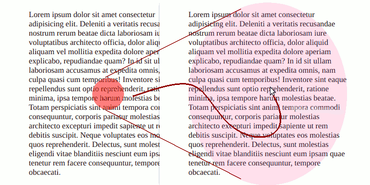
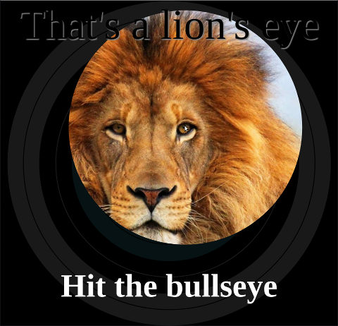
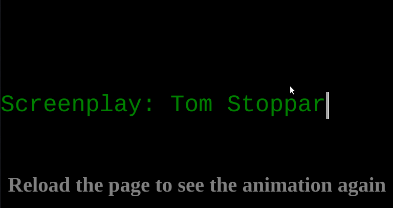

# Interactions

## clip-path
- [ ] `circle()`
  * default settings
  * radius
  * center
- [ ] `ellipse()`
  * default settings
  * horizontal and vertical radius
  * center
- [ ] `inset()`
- [ ] `polygon()`
  * x y coordinate pairs
  * auto closing
  * crossing lines
  * creating holes
* `path()`
- [ ] Use with images, text, containers
- [ ] `:hover` only active over visible part of clipped elementurc

### Resources
* [Slides](slides/interaction/clip-path.pdf)
* [MDN](https://developer.mozilla.org/en-US/docs/Web/CSS/clip-path)
* [Basic Shapes](https://developer.mozilla.org/en-US/docs/Web/CSS/basic-shape)
* [Clippy](https://bennettfeely.com/clippy/)
* [CSS Tricks](https://css-tricks.com/animating-with-clip-path/)
* [Digital Ocean](https://www.digitalocean.com/community/tutorials/css-clipping-with-clip-path)
* https://www.smashingmagazine.com/2016/05/

## Pseudo-elements
* [CSS Tricks](https://css-tricks.com/pseudo-element-roundup/)
* [Smashing Magazine](https://www.smashingmagazine.com/2016/05/an-ultimate-guide-to-css-pseudo-classes-and-pseudo-elements/)
* [FreeCodeCamp](https://www.freecodecamp.org/news/css-pseudo-elements-before-and-after-selectors-explained/)

## Transitions
- [ ] `transition` shorthand property [MDN](https://developer.mozilla.org/en-US/docs/Web/CSS/transition)
- [ ] `transition-property` [MDN](https://developer.mozilla.org/en-US/docs/Web/CSS/transition-property)
- [ ] `transition-duration` [MDN](https://developer.mozilla.org/en-US/docs/Web/CSS/transition-duration)
- [ ] `transition-delay` [MDN](https://developer.mozilla.org/en-US/docs/Web/CSS/transition-delay)
- [ ] `transition-timing-function` [MDN](https://developer.mozilla.org/en-US/docs/Web/CSS/transition-timing-function)

### Resources
* [MDN: Using CSS Transitions](https://developer.mozilla.org/en-US/docs/Web/CSS/CSS_Transitions/Using_CSS_transitions)
* [Animatable CSS properties](https://developer.mozilla.org/en-US/docs/Web/CSS/CSS_animated_properties)

## Transforms
- [ ] `transform` [MDN](https://developer.mozilla.org/en-US/docs/Web/CSS/transform)
- [ ] `rotate()` [MDN](https://developer.mozilla.org/en-US/docs/Web/CSS/transform-function/rotate())
- [ ] `translate()` [MDN](https://developer.mozilla.org/en-US/docs/Web/CSS/transform-function/translate())
- [ ] `translateX` [MDN](https://developer.mozilla.org/en-US/docs/Web/CSS/transform-function/translateX)
- [ ] `translateY` [MDN](https://developer.mozilla.org/en-US/docs/Web/CSS/transform-function/translateY)
- [ ] `translateZ` [MDN](https://developer.mozilla.org/en-US/docs/Web/CSS/transform-function/translateZ)
- [ ] `scale()` [MDN](https://developer.mozilla.org/en-US/docs/Web/CSS/transform-function/scale())
- [ ] `scaleX()` [MDN](https://developer.mozilla.org/en-US/docs/Web/CSS/transform-function/scaleX())
- [ ] `scaleY()` [MDN](https://developer.mozilla.org/en-US/docs/Web/CSS/transform-function/scaleY())
- [ ] `skew() `[MDN](https://developer.mozilla.org/en-US/docs/Web/CSS/transform-function/skew())

### Resources
* [Slides](slides/interaction/transform.pdf)

## Animations
- [ ] `animation` shorthand property [MDN](https://developer.mozilla.org/en-US/docs/Web/CSS/animation)
- [ ] `animation-name` [MDN](https://developer.mozilla.org/en-US/docs/Web/CSS/animation-name)
- [ ] `animation-duration` [MDN](https://developer.mozilla.org/en-US/docs/Web/CSS/animation-duration)
- [ ] `animation-timing-function` [MDN](https://developer.mozilla.org/en-US/docs/Web/CSS/animation-timing-function)
- [ ] `ease`
- [ ] `ease-in`
- [ ] `ease-out`
- [ ] `ease-in-out`
* `cubic-bezier` [CSS tricks](https://css-tricks.com/advanced-css-animation-using-cubic-bezier/)
- [ ] `linear`
- [ ] `steps()`
- [ ] `animation-delay` [MDN](https://developer.mozilla.org/en-US/docs/Web/CSS/animation-delay)
- [ ] `animation-iteration-count` [MDN](https://developer.mozilla.org/en-US/docs/Web/CSS/animation-iteration-count)
- [ ] number
- [ ] infinite
- [ ] `animation-direction` [MDN](https://developer.mozilla.org/en-US/docs/Web/CSS/animation-direction)
- [ ] `normal`
- [ ] `reverse`
- [ ] `alternate`
- [ ] `alternate-reverse`
- [ ] `animation-fill-mode` [MDN](https://developer.mozilla.org/en-US/docs/Web/CSS/animation-fill-mode)
- [ ] `none`
- [ ] `forwards`
- [ ] `backwards`
- [ ] `both`
- [ ] `animation-play-state` [MDN](https://developer.mozilla.org/en-US/docs/Web/CSS/animation-play-state)
- [ ] `paused`
- [ ] `running`
- [ ] `@keyframes` at-rule [MDN](https://developer.mozilla.org/en-US/docs/Web/CSS/@keyframes)
- [ ] `%`
- [ ] `from`
- [ ] `to`

### Resources
* [Slides](slides/interaction/animation.pdf)
* [MDN: Using CSS Animations](https://developer.mozilla.org/en-US/docs/Web/CSS/CSS_Animations/Using_CSS_animations)
* [Intro to CSS Animations](https://dev.to/ljcdev/introduction-to-css-animation-4762)
* [Animations Cheat Sheet](https://learn-the-web.algonquindesign.ca/topics/css-animations-effects-cheat-sheet/)

## Miscellaneous
- [ ] [`ch` width of 0 character](https://meyerweb.com/eric/thoughts/2018/06/28/what-is-the-css-ch-unit/)
= [ ] [CSS custom properties](https://developer.mozilla.org/en-US/docs/Web/CSS/--*)

# Exercises

* [Clip Transition]( https://dciforks.github.io/UIB-interaction-clip-transition/)

  

* [Sliding Square](https://classroom.github.com/a/OTaBJISV)

  

* [Bullseye](https://classroom.github.com/a/9AnBAA_E)

  

* [Typewriter](https://classroom.github.com/a/D2r-LFWt)

  
