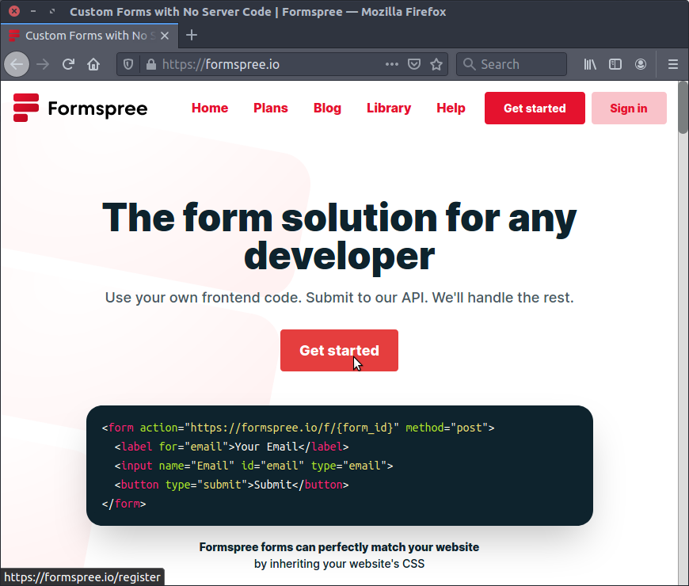
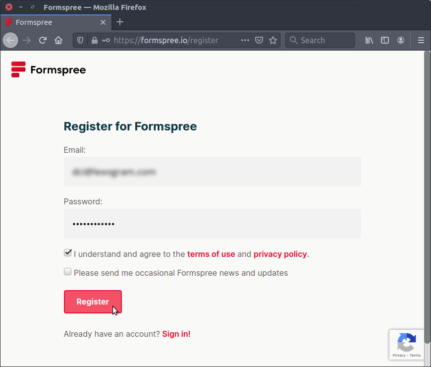
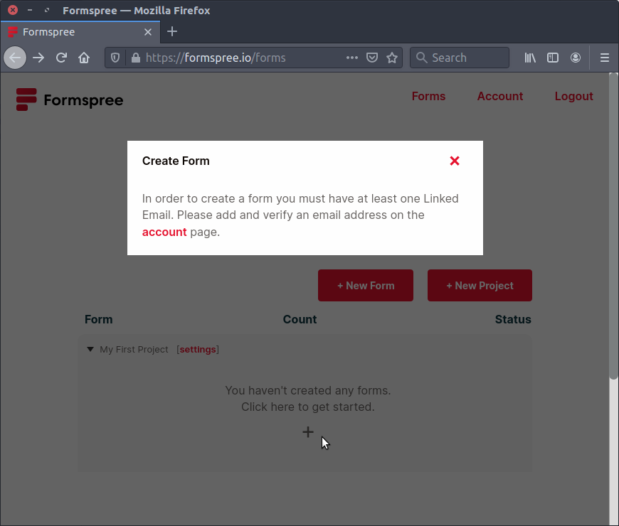
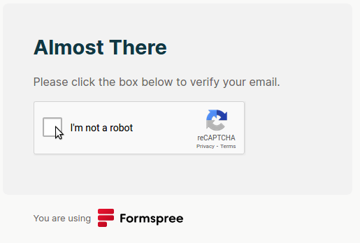
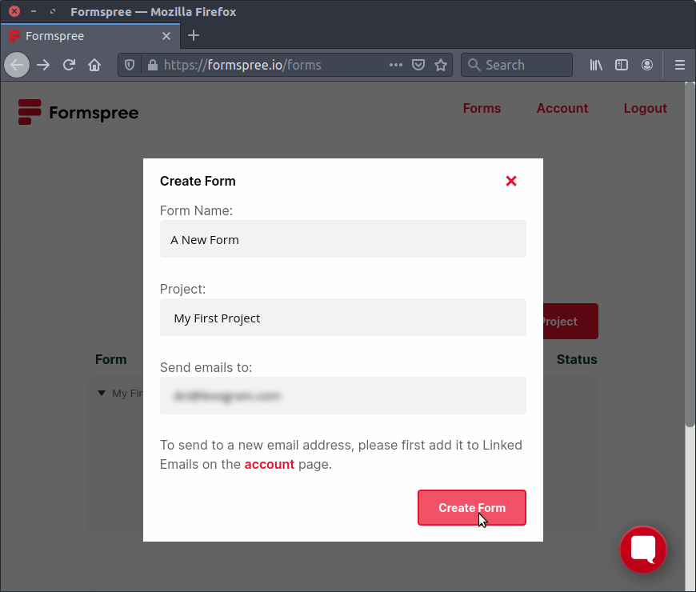
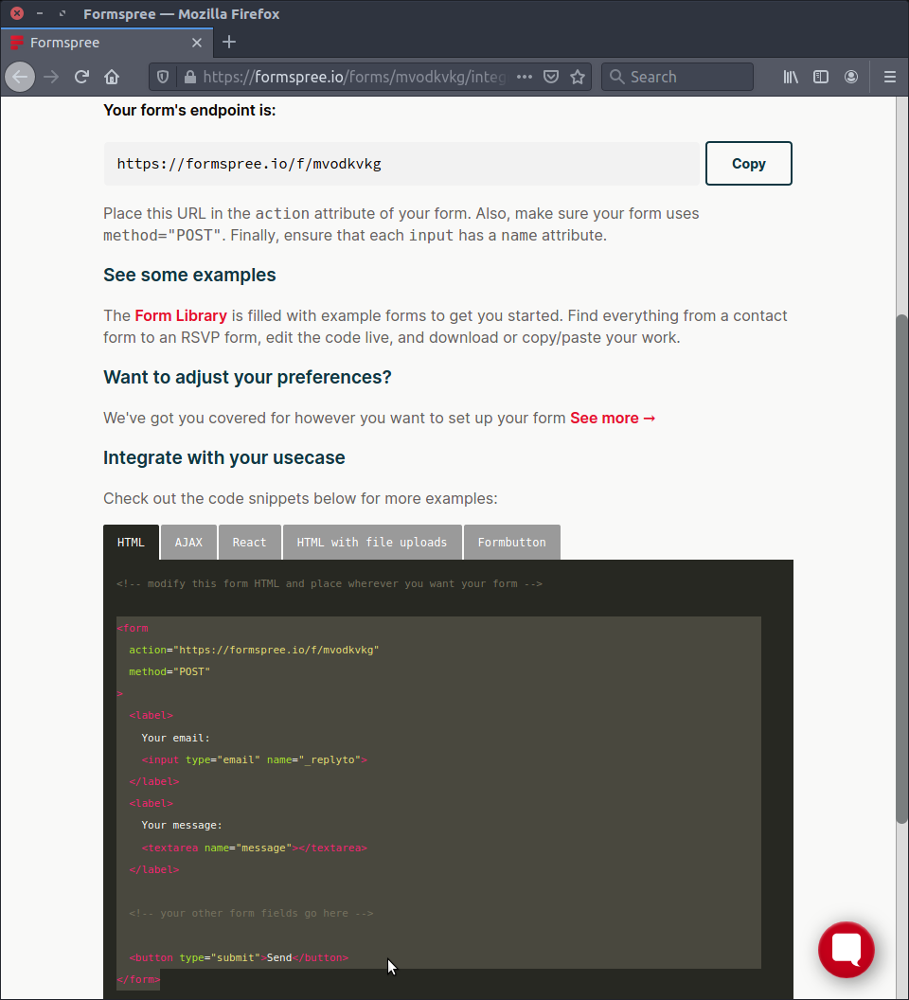
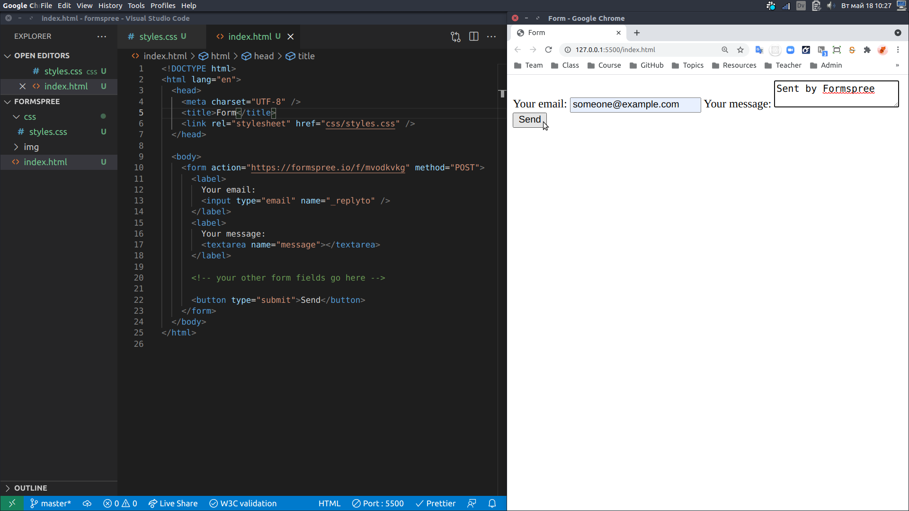
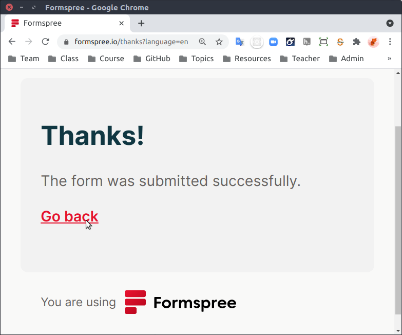
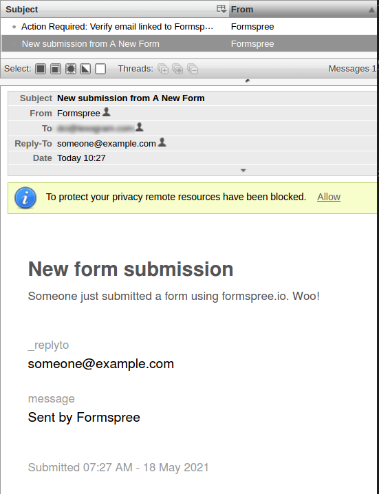

# Working with Formspree

A form requires a _backend_ server to process the data submitted by the user. The Live Server plugin that you are using with VS Code is not designed for this purpose. It only acts as a _frontend_ to serve the pages that you will see in your browser.

You can register with a number of _form builder_ web sites, which will send you an email (or do other tasks) in response to each form submission.

[Formspree](https://formspree.io) is one option. It allows you to submit 50 forms per month, for free. You can find details of similar sites at the end of this article.

## Register

1. Visit [the Formspree web site](https://formspree.io)
2. Click the Get Started button
   
3. Enter your email address and password.
4. You might want to use a [custom Gmail address](https://support.google.com/a/users/answer/9308648?hl=en) to filter out messages
5. Read the Terms Of Use and Privacy Policy
6. Click Register
   
7. You won't be able to create a form until you have confirmed your email address
   
8. Go to your email account
9. Find the email from Form Spree
10. Click the reCAPTCHA to ~~help Google train its AI~~ confirm your email address
    

## Create a form
10. Refresh the page at Formspree.io
11. Click on the New Form button or the grey Click Here To Get Started field
    
12. Give you form a name
13. Check the details
14. Click on Create Form
15. Copy the HTML code snippet
    
16. In VS Code, create a new HTML page, and paste the copied snippet into the body.
    
17. Click the Go Live! button to serve the page in Google Chrome
18. Enter some details, and press the Submit button
19. You'll be redirected to a Formspree confirmation page
    

## Check the result
20. Check your email for a confirmation message
    

---

**Your form worked!**

(Or at least, it sent a POST request to Formspree.io, and you got feedback from how your form had been filled in.)

---

## Limitations of a Free Account

With a free account you can "[u]se Formspree for testing and development with unlimited projects and forms, limited to 50 submissions/mo."

[Review of form builder sites](https://patrickposner.dev/forms-on-a-static-site/)

Alternatives with free plans (50 submissions / month):
   * [getform](https://getform.io/)
   * [FormKeep](https://formkeep.com/)
   * [formcarry.](https://formcarry.com/)
   * [FormBackend](https://www.formbackend.com/)
