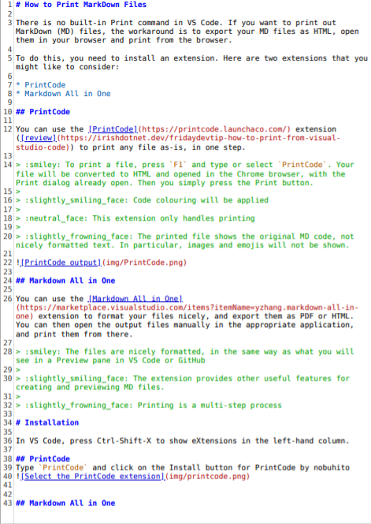

# How to Print MarkDown Files

There is no built-in Print command in VS Code. If you want to print out MarkDown (MD) files, the workaround is to export your MD files as HTML, open them in your browser and print from the browser.

To do this, you need to install an extension. Here are two extensions that you might like to consider:

* PrintCode
* Markdown All in One

## PrintCode

You can use the [PrintCode](https://printcode.launchaco.com/) extension ([review](https://irishdotnet.dev/fridaydevtip-how-to-print-from-visual-studio-code)) to print any file as-is, in one step.

> :smiley: To print a file, press `F1` and type or select `PrintCode`. Your file will be converted to HTML and opened in the Chrome browser, with the Print dialog already open. Then you simply press the Print button.
>
> :slightly_smiling_face: You can print any kind of file (HTML, CSS, JavaScript, ...), not just MarkDown
>
> :slightly_smiling_face: Code colouring and line numbering will be applied
>
> :neutral_face: This extension only handles printing
>
> :slightly_frowning_face: The printed file shows the original MD code, not nicely formatted text. In particular, images and emojis will not be shown.

## Markdown All in One

You can use the [Markdown All in One](https://marketplace.visualstudio.com/items?itemName=yzhang.markdown-all-in-one) extension to format your files nicely, and export them as HTML. You can then open the output files manually in the appropriate application, and print them from there.

> :smiley: The files are nicely formatted, in the same way as what you will see in a Preview pane in VS Code or GitHub
>
> :slightly_smiling_face: The extension provides other useful features for creating and previewing MD files.
>
> :neutral_face: This extension only handles MarkDown
>
> :slightly_frowning_face: Printing is a multi-step process

# Installation and Printing

In VS Code, press Ctrl-Shift-X to show eXtensions in the left-hand column.

## PrintCode
* To install:
  * Type `PrintCode` and click on the Install button for PrintCode by nobuhito

* To print:
  1. Press `F1`
  1. Type or select `PrintCode` then
  1. Press Enter
  1. Your browser will open to show the document, with the Print dialog open
  1. Press Enter or the Print button

## Markdown All in One
* To install:
  * Type `markdown` and click on the Install button for Markdown All in One by Yu Zhang

* To print:
  1. Press `F1`
  1. Type `Markdown print`, if necessary to filter for the required command
  1. Select `Markdown All in One: Print current document to HTML`
  1. Press Enter
  1. Copy the path to your open MD file to the clipboard (Alt-Ctrl-C)
  1. In the Terminal, type `google-chrome ` then paste the path that you copied (Ctrl-Shift-V)
  1. Replace the `.md` extension with `.html`
  1. Press Enter
  1. Google Chrome should open to display the newly created HTML document
  1. Press Ctrl-P to open the Print dialog
  1. Press Enter or the Print button

GUI Alternative:

5. Open the containing folder for your document in Nautilus
   * Right-Click on file name in Explorer column
   * Select Open Containing Folder (Alt-Ctrl-R)
   * Use Alt-Tab to switch to the Files program, if necessary
6. Double-click on the file to open it in your browser
7. Continue from step 10 above
